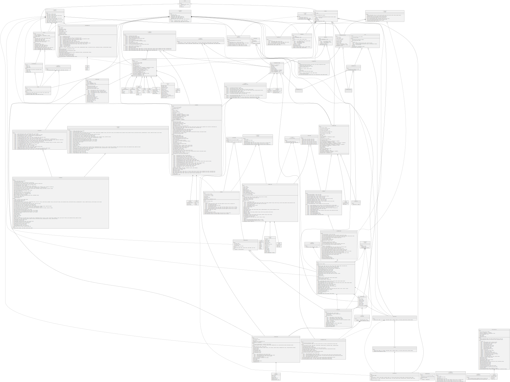

# Origins

The Origins Platform Smart Contracts

## Badges

Version & Tag:

Issue & PR:

CI & Code Coverage:

Code Style:

Metrics & Activity:

## **User Manual**

To skip general description and structure review and go over to creating/adding Origins sales/new tier (sale), jump to **[User Manual](USER-MANUAL.md)**

## Main Contracts

- OriginsStorage
- OriginsAdmin
- OriginsEvents
- OriginsBase
- LockedFund

### OriginsStorage

A contract with all the storage of `OriginsBase`. Basically acts as the harddisk of the system.

### OriginsAdmin

A basic contract with currently two main roles:

- Owner
- Verifier

An owner has the right on major decision making functions. The owner has too many rights, including the withdrawal of proceedings, thus it is recommended to use a multisig for the same.

A Verifier currently has the right to add any address as verified. To make someone a verifier, owner should call the `addVerifier` function in OriginsAdmin.

### OriginsEvents

A contract with all the events of `OriginsBase` listed in it.

### OriginsBase

This is the main contract which does all the major works. Each sale is a Tier. And a single contract will be enough to do multiple sales of a unique Token.

The proceedings of the raised amount could be taken by the owner or a pre-set deposit address.

Tier creation could be done with a single function call, or can be done by multiple calls. Individual Tier parameters can be edited as well based on Tier ID.

Verification of participants at the moment can be done by address. And any verifier can add address and tiers for which the address is approved. Verification Type also gives freedom to pass anyone, thus allowing a public sale.

Sale time is also dependent on two different methods mainly, one is duration (calculated from the start time) or the end timestamp itself. Another method is until supply last as well.

Deposit asset can be either RBTC or any other ERC20 Compliant Token as well, and it can be unique for each tier also.

Transfer Type can be:

- `None`, Transfer hasn't set yet. This is default.
- `Unlocked`, Tokens are unlocked immediately
- `WaitedUnlock`, which means the unlock will happen after a certain period
- `Locked`, which means the tokens will be a linear vesting
- `Vested`, which is tokens vested linearly, but the difference being the voting power in Governance.

The current version only support None, Unlocked, Waited Unlock and Vested for now.

The contract also keeps track of participating wallets per tier, the number of tokens sold per tier, etc.

### LockedFund

Currently it's functionality is limited to vest tokens and withdraw tokens after a certain time period. In the future, it will allow for further features like locked tokens and unlocked tokens, etc.

For Vesting, it uses the contracts of `Sovryn-smart-contract` repo. The registry used in this case with be `VestingRegistry3`.

## Call Graph

P.S. It is a simple project, isn't it?

## UML Diagram

## Inheritance

## Deployment

Deployment README's are mentioned in the scripts folder. There are mainly two.

- Origins - The script contains all the Origins and LockedFund related deployment and interaction script.
- Token - The script contains all the Token, Governance, Staking, Vesting, etc related deployment and interaction script.

### Deployment Parameters

Please make sure to read the README mentioned in the scripts folder before running it.

## Assumptions

- Admin has a lot of power, and is assumed to be the right, fair and just person/party. It is highly advised to have a multisig as admin, rather than just a EOA.

## Limitations

- If the deposit asset price is lower than the token which is sold, currently that is not possible with this system. A simple solution is to have a divisor constant or a numerator & denominator system instead of the rate system.
- LockedFund can only have a single cliff and duration per person. Tier based system would be much better when the vesting registry is updated (waiting for a PR to be merged in Sovryn).
- Address can only be validated, and cannot be invalidated. Adding a simple function should suffice. To be done in the next update.

## Improvements

- NFT Based Sale.
- Decoupling Tier for lesser gas usage and minimize the stack too deep error.
- Fee for use of Origins platform (Contracts, UI and Setup).
- Maybe a single contract can act as the platform if instead of different tiers based on ID, the tiers are based on token address (which is to be sold), thus having multiple tiers based on that. So, a single contract can handle multiple sales at once with multiple tiers. This can only be done after struct decoupling and gas profiling of each function and possible gas saving methods added.
- Total unique wallets participated in all tiers. Currently only unique wallets participated in a each tier is counted, which is not the same as unique wallets participated in all tiers combined. New storage structure will be required.
- Tests related to other type of sales to be added.
- Reduce the reason string text size, or use a numbering system with errors in mainly LockedFund and OriginsBase.
- `saleEndDurationOrTS` in OriginsBase has little upside for storing and might be removable in the future.
